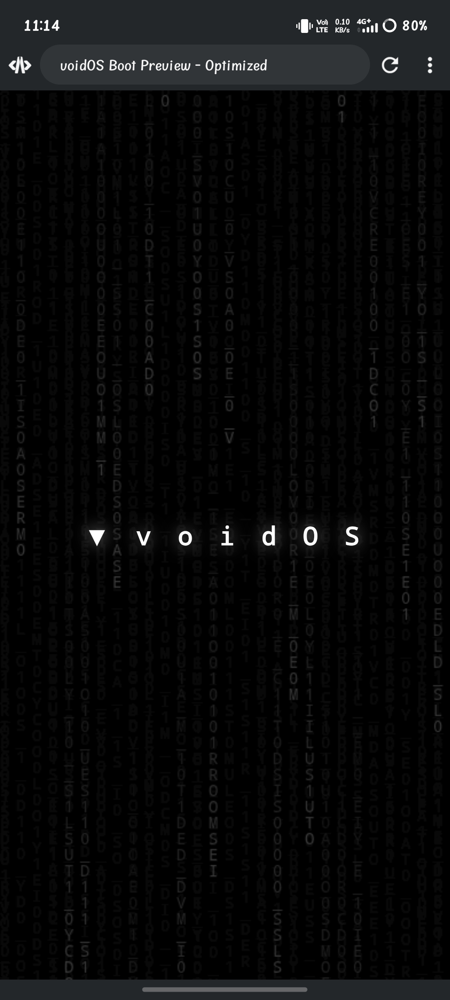

# ▼ voidOS

**Privacy-First • De-Googled • Android 14 based Mobile OS**

> "Nothing to hide, nothing to track"

---

## Privacy Architecture

| Subsystem | Protection |
|-----------|------------|
| Network | Framework-level tracker firewall |
| Camera/Mic | Background access blocked, dummy stream |
| GPS | 2km coordinate fuzzing |
| Clipboard | Background app access denied |
| Telemetry | Python-based AOSP source stripper |
| Memory | Native C++ sanitizer daemon |

---

## Key Features
- Zero Google Services — fully de-Googled
- MicroG support — optional
- F-Droid + Aurora Store
- Custom SELinux security policies
- Hardened build flags
- Matrix-style boot animation

---

## Current Status
🚧 Pre-Alpha — First bootable build target: Q3 2026

---

## Roadmap
- [ ] First bootable build (Q3 2026)
- [ ] Security hardening
- [ ] Seedvault encrypted backup
- [ ] Official documentation
- [ ] Community device builds

---

## License
AGPL-3.0